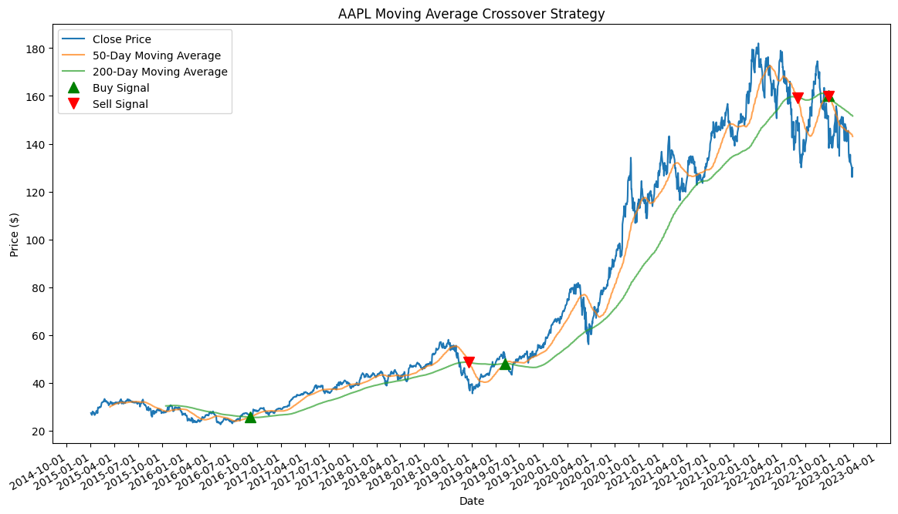
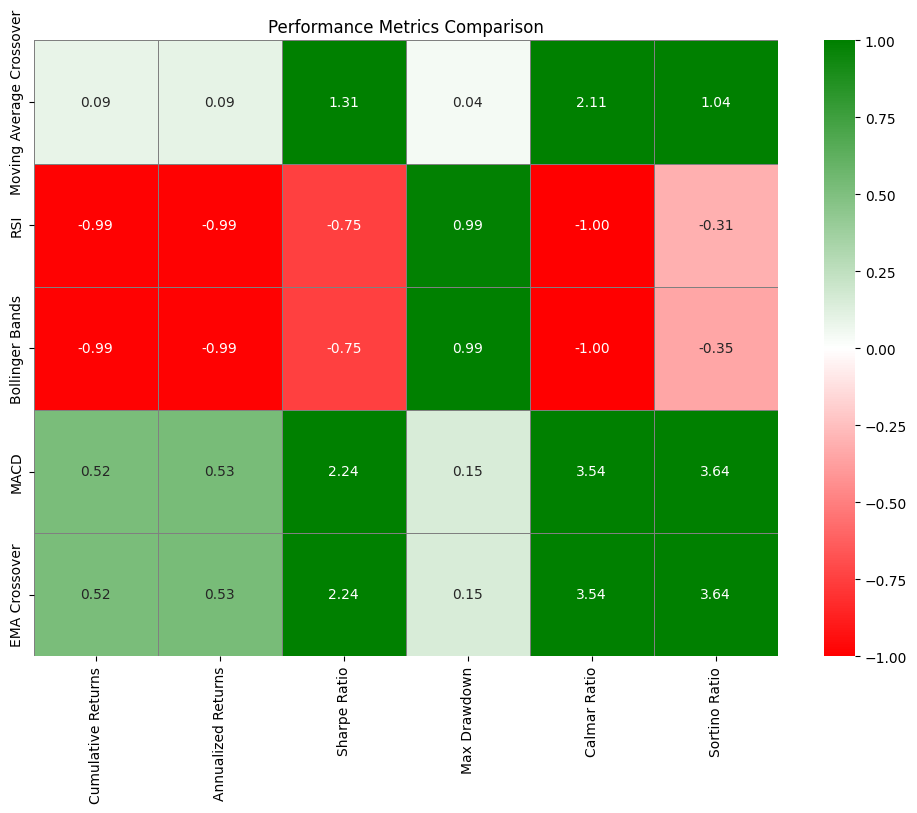
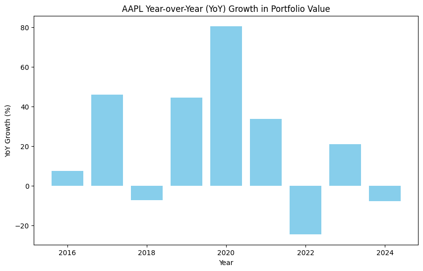

# Technical Analysis Strategies: Backtesting and Comparison

## Overview

This project focuses on evaluating and comparing several popular technical analysis strategies for stock trading. The primary goal is to determine the effectiveness of each strategy by backtesting them with historical data, calculating performance metrics, and visualizing results.

### Technical Analysis Strategies Included

1. **Moving Average Crossover**
2. **Relative Strength Index (RSI)**
3. **Bollinger Bands**
4. **MACD (Moving Average Convergence Divergence)**
5. **EMA (Exponential Moving Average) Crossover**

## Objectives

- **Backtest Various Strategies**: Evaluate different trading strategies using historical stock data.
- **Calculate Performance Metrics**: Assess strategies based on cumulative returns, Sharpe Ratio, annualized returns, and more.
- **Visualize Results**: Create plots to visualize buy/sell signals, portfolio value over time, and performance metrics.
- **Compare Strategies**: Identify the most effective strategies based on performance metrics.

## Setup and Installation

To get started, clone the repository and install the required packages:

```bash
git clone https://github.com/yourusername/technical-analysis.git
cd technical-analysis
pip install -r requirements.txt


1. Buy/Sell Signals and Portfolio Value
Visualize the trading signals and portfolio value over time for different strategies.


2. Performance Metrics Heatmap
A heatmap showing various performance metrics for each strategy, where higher scores are indicated in green and lower scores in red.



3. Year-over-Year Portfolio Value
Compare the Year-over-Year (YoY) portfolio value for the top-performing strategies.


Key Plots
1. Buy/Sell Signals and Portfolio Value
This plot displays the buy and sell signals generated by each strategy overlaid on the stock price chart, as well as the portfolio value over time. It provides a visual understanding of how trading signals translate into portfolio performance.


2. Performance Metrics Heatmap
The heatmap illustrates various performance metrics for each strategy. The color gradient from red to green highlights lower to higher scores, making it easy to compare the effectiveness of each strategy at a glance.


3. Year-over-Year Portfolio Value
This plot compares the Year-over-Year (YoY) portfolio value of the top-performing strategies. It provides insights into the long-term performance and stability of the selected strategies.


Key Takeaways
Bollinger Bands
Strengths:

Good for identifying volatility and potential reversal points.
Effective in range-bound or volatile markets.
Weaknesses:

May generate false signals in strongly trending markets.
Requires additional confirmation to reduce false positives.
Relative Strength Index (RSI)
Strengths:

Useful for identifying overbought or oversold conditions.
Can signal potential reversal points.
Weaknesses:

Less effective in trending markets.
Might produce frequent signals in sideways markets.
Common Technical Analysis Strengths and Weaknesses
Strengths:

Quantifiable: Provides objective, historical data-driven insights.
Actionable Signals: Can help in making trading decisions based on historical patterns.
Weaknesses:

Lagging Indicators: Most strategies are based on past data and may lag behind market movements.
False Signals: Can produce false signals, especially in volatile or trending markets.
Over-Reliance on Historical Data: Past performance is not always indicative of future results.
Value and Future Opportunities
The analysis provides valuable insights into the performance of various technical analysis strategies. By visualizing and comparing these strategies, traders can make more informed decisions.

Opportunities for Leveraging Machine Learning
Predictive Models: Use machine learning models to predict future price movements based on technical indicators.
Strategy Optimization: Employ algorithms to optimize strategy parameters for better performance.
Anomaly Detection: Implement models to identify unusual market conditions or outliers in trading signals.
Automated Trading: Develop automated trading systems that incorporate machine learning for real-time decision-making.
Conclusion
This project demonstrates how to evaluate and compare technical analysis strategies, offering a comprehensive understanding of their performance. By integrating machine learning, you can further enhance the effectiveness of these strategies and adapt to evolving market conditions.

For further details and code implementation, please refer to the project files in this repository.